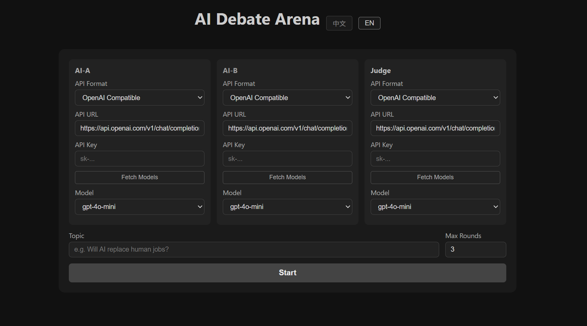

# DuelAI

## 中文说明

一个简单的 AI 辩论小工具：接入 API 后，让 AI-A 与 AI-B 围绕同一议题进行观点生成、矛盾判定与多回合辩论，最后由裁判模型给出总结。

### 功能

- 支持 AI-A / AI-B / 裁判 三角色独立配置
- 支持 OpenAI 兼容接口与 Claude 接口
- 支持在线拉取模型列表，也支持手动填写模型名称
- 自动判定双方观点是否存在矛盾
- 多回合攻防辩论
- 裁判最终总结
- 一键导出辩论文本

### 使用

1. 打开 `index.html`
2. 分别填写 AI-A、AI-B、裁判的 API Key
3. 选择或手动填写模型，并输入议题
4. 点击“开始”

### GitHub Pages 一键在线访问

本项目是纯静态页面，可直接部署到 GitHub Pages，用户点链接即可使用。

1. 将仓库推送到 GitHub（默认分支 `main` 或 `master`）
2. 仓库中已包含工作流：`.github/workflows/deploy-pages.yml`
3. 在 GitHub 仓库中打开：`Settings -> Pages`，`Source` 选择 `GitHub Actions`
4. 首次推送后等待 Actions 执行完成，即可通过以下地址访问：
   `https://<你的GitHub用户名>.github.io/<仓库名>/`

### 页面预览

---

## English

A lightweight AI debate playground: connect APIs, let AI-A and AI-B generate initial views, have a judge model detect conflicts, run multi-round rebuttals, and produce a final summary.

### Features

- Independent configuration for AI-A / AI-B / Judge
- Supports OpenAI-compatible APIs and Claude APIs
- Fetch model lists online, with manual model name input fallback
- Automatic conflict detection between initial views
- Multi-round debate flow
- Final judge summary
- One-click export of debate transcript

### Usage

1. Open `index.html`
2. Fill API keys for AI-A, AI-B, and Judge
3. Select or manually enter models, then enter a topic
4. Click "Start"

### Deploy To GitHub Pages

This project is a static site and can be hosted on GitHub Pages so users can open it directly via URL.

1. Push this repo to GitHub (`main` or `master`)
2. The workflow is included at `.github/workflows/deploy-pages.yml`
3. In your repo, go to `Settings -> Pages`, and set `Source` to `GitHub Actions`
4. After the first successful Actions run, open:
   `https://<your-github-username>.github.io/<repo-name>/`
